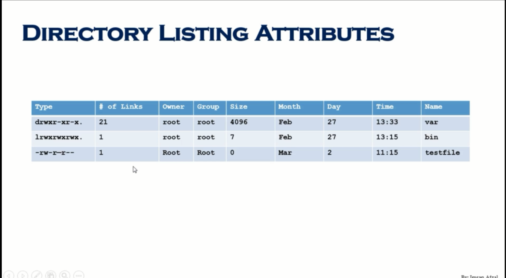

 
> `` cd / ``
> 
>  `` ls -l `` 
> * any file begin with `d` is directory 
> * any file begin with `l` is link 
> * any file which don't  have anything like them, they are just files

creat files
* `touch` creats an empty file new file
* `cp` copy a copy of new file at required destination
* `vi` its an editor 

creating directory
* mkdir 
