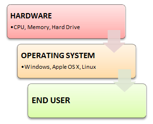

#### 1) What is Linux?
> Linux is an operating system or a kernel distributed under an open-source license. Its functionality list is quite like UNIX. The kernel is a program at the heart of the Linux operating system that takes care of fundamental stuff, like letting hardware communicate with software.
#### 2) What is the difference between UNIX and LINUX?
> Unix originally began as a propriety operating system from Bell Laboratories, which later on spawned into different commercial versions. On the other hand, Linux is free, open source and intended as a non-propriety operating system for the masses.
#### 3) What is BASH?
> BASH is short for Bourne Again SHell. It was written by Steve Bourne as a replacement to the original Bourne Shell (represented by /bin/sh). It combines all the features from the original version of Bourne Shell, plus additional functions to make it easier and more convenient to use. It has since been adapted as the default shell for most systems running Linux.

#### 4) What is Linux Kernel?
> The Linux Kernel is a low-level systems software whose main role is to manage hardware resources for the user. It is also used to provide an interface for user-level interaction.

#### 5) What is LILO?
> LILO is a boot loader for Linux. It is used mainly to load the Linux operating system into main memory so that it can begin its operations.

#### 6) What is a swap space?
> Swap space is a certain amount of space used by Linux to temporarily hold some programs that are running concurrently. This happens when RAM does not have enough memory to hold all programs that are executing.

#### 7) What is the advantage of open source?
> Open source allows you to distribute your software, including source codes freely to anyone who is interested. People would then be able to add features and even debug and correct errors that are in the source code. They can even make it run better and then redistribute these enhanced source code freely again. This eventually benefits everyone in the community.

#### 8) What are the basic components of Linux?
> Just like any other typical operating system, Linux has all of these components: kernel, shells and GUIs, system utilities, and an application program. What makes Linux advantageous over other operating system is that every aspect comes with additional features and all codes for these are downloadable for free.

#### 9) Does it help for a Linux system to have multiple desktop environments installed?
> In general, one desktop environment, like KDE or Gnome, is good enough to operate without issues. It’s all a matter of preference for the user, although the system allows switching from one environment to another. Some programs will work in one environment and not work on the other, so it could also be considered a factor in selecting which environment to use.

#### 10) What is the basic difference between BASH and DOS?
> - The key differences between the BASH and DOS console lie in 3 areas:
> + BASH commands are case sensitive while DOS commands are not;
> * Under BASH, / character is a directory separator and \ acts as an escape character. Under DOS, / serves as a command argument delimiter and \ is the directory separator
> - DOS follows a convention in naming files, which is 8 character file name followed by a dot and 3 characters for the extension. BASH follows no such convention.

#### 11) What is the importance of the GNU project?
> This so-called Free software movement allows several advantages, such as the freedom to run programs for any purpose and freedom to study and modify a program to your needs. It also allows you to redistribute copies of software to other people, as well as the freedom to improve software and have it released for the public.
#### 12) Describe the root account.
> The root account is like a systems administrator account and allows you full control of the system. Here you can create and maintain user accounts, assigning different permissions for each account. It is the default account every time you install Linux.

#### 13) What is CLI?
> CLI is short for Command Line Interface. This interface allows the user to type declarative commands to instruct the computer to perform operations. CLI offers greater flexibility. However, other users who are already accustomed to using GUI find it difficult to remember commands including attributes that come with it.

#### 14) What is GUI?
> GUI, or Graphical User Interface, make use of images and icons that users click and manipulate as a way of communicating with the computer. Instead of having to remember and type commands, the use of graphical elements makes it easier to interact with the system, as well as adding more attraction through images, icons, and colors.

#### 15) How do you open a command prompt when issuing a command?
> To open the default shell (which is where the command prompt can be found), press Ctrl-Alt-F1. This will provide a command line interface (CLI) from which you can run commands as needed.